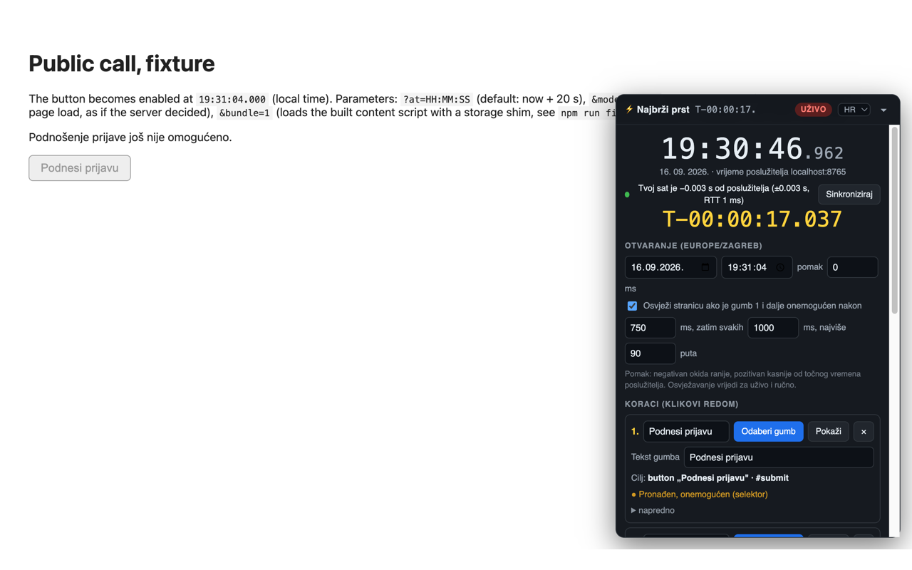
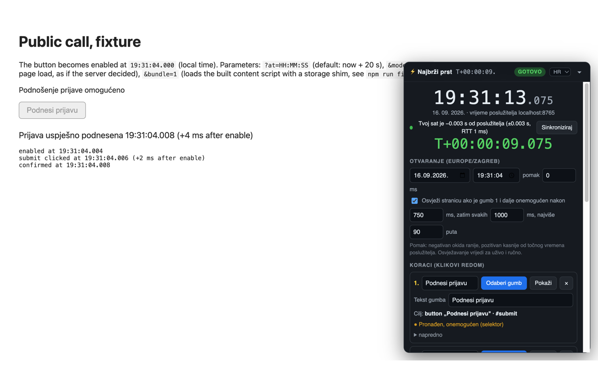

# Najbrži prst

Chrome extension that clicks a chosen button at an exact server-synced second.
Made for Croatian public calls where funds go by order of receipt (eFZOEU), it
works on any site: pick the button, set the opening time, and the extension
syncs a clock to the server, counts down, and either clicks for you or hands the
button to you at the right second.

Not affiliated with FZOEU or any portal. Read
[Terms of use before going live](#terms-of-use-before-going-live).



## What it does

- Syncs a clock to the target server from the `Date` header by catching the
  second boundary, then shows server time with milliseconds and a countdown on
  the page itself, time.is style.
- Lets you pick the exact button with a crosshair. It stores a stable CSS
  selector plus the button text and verifies both before clicking. Disabled
  buttons can be picked too.
- Runs an ordered list of clicks. Each step waits until its button is visible
  and enabled, clicks, and retries until the success text or the next button
  shows up. The last step clicks once, never twice.
- Reloads the page if the first button is still disabled after the opening
  second, and resumes automatically after the reload.
- Three modes: **Manual** (countdown, flash, beep, focus, you press the button),
  **Dry run** (highlights instead of clicking) and **Live** (clicks).
- Croatian and English UI, switch in the panel head or in the popup.

Measured on the local fixture in a real Chrome tab: button enabled at
19:07:53.001, first click at .002, confirm at .004. With a page that only
enables the button on load, reload and resume landed the click 8 ms after the
button appeared.



## Install

From a release:

1. Download `najbrzi-prst-vX.Y.Z.zip` from
   [Releases](https://github.com/dineeek/najbrzi-prst/releases) and unzip it.
2. Open `chrome://extensions`, enable Developer mode, choose "Load unpacked" and
   select the unzipped folder.

From source:

```bash
npm install
npm run build
```

Then load the `dist/` folder the same way. Rebuild and press the reload icon
after changes.

## Enable it on a site

The extension asks for no site access up front. Open the page, click the toolbar
icon and press "Uključi na …" / "Enable on …". The panel appears at the bottom
right of that site from then on. Remove a site from the same popup.

## Set up on the page

1. Log in and open the page with the button you need. For eFZOEU, log in the
   evening before: a NIAS session lasts 24 hours, and one credential cannot be
   open on two devices.
2. Set the opening date and time. The time zone is your browser's, shown in the
   heading. The countdown starts.
3. For each step press "Odaberi gumb" / "Pick button" and click the real button
   on the page. The row shows what was captured and whether it is currently
   found, enabled or hidden. "Pokaži" / "Show" flashes it.
4. Optionally fill in "Tekst uspjeha" / "Success text", the text that appears
   when the whole run succeeded. Button text can be a regex such as `/^da\b/` or
   `/^yes\b/`, which also matches „Da, podnesi prijavu" and „Yes, submit". Text
   fallback prefers a button inside an open dialog and never clicks anything
   that reads like cancel.
5. Press "Proba odmah" / "Dry run now" to rehearse: every button is flashed,
   nothing is clicked.
6. Ten minutes before opening arm the mode you want. Keep the tab visible and
   the window focused. The panel holds a screen wake lock while armed.
7. While armed every setting is locked, only STOP, Sync and the language switch
   stay active. "ZAUSTAVI" / "STOP" or `Esc` disarms at any time and unlocks
   them.

On `efzoeu.gov.hr` and `fondovi.gov.hr` the steps come prefilled from the
official eFZOEU manual: step 1 „Podnesi prijavu", step 2 `/^da\b/` for the
confirm dialog, success text „Prijava uspješno podnesena". Calibrate them on the
real page with the picker before the day.

## Terms of use before going live

The eFZOEU terms of use (Opći uvjeti korištenja sustava eFZOEU, članak 10.
stavak 7.) say the operator will terminate the user agreement without notice,
block the account and exclude the applicant from funding if the system is used
„na automatiziran, robotiziran ili sličan način u svrhu stjecanja neopravdane
prednosti, a posebno ukoliko se sustav eFZOEU na ovaj način koristi prilikom
podnošenja prijave". A submit that lands milliseconds after opening is also easy
to spot on the server. Live mode on eFZOEU is a real risk to the grant itself.
Other portals may have similar rules, read them first.

The compliant way is "Aktiviraj RUČNO" / "Arm MANUAL": the same synced clock and
countdown, and at the opening second the panel flashes, beeps and focuses the
button, but you press it. Nothing is clicked for you.

## Rehearse locally

```bash
npm run fixture:bundle   # builds the extension and a fixture bundle
npm run fixture          # serves test/fixture on port 8765
```

Open `http://localhost:8765/?at=HH:MM:SS&bundle=1` (local time). The page
enables a submit button at that second, shows a confirm dialog, and prints how
many milliseconds after enabling each click landed. `&bundle=1` loads the built
content script with a storage shim, so no extension install is needed. Add
`&mode=reload` to simulate a server that only reveals the enabled button on page
load, which exercises the reload path. Add `&lang=hr` for the eFZOEU wording.
Pick the two buttons with the picker, set the success text to
`submitted successfully` (or „uspješno podnesena"), and arm.

## Clock sync

The extension sends `HEAD` requests to the site origin (`/favicon.ico` first,
then a few fallbacks) every 25 ms until the `Date` header ticks over, which
brackets the server second boundary between two local timestamps. Later rounds
are aimed at the next boundary, so a full sync is four rounds and well under a
hundred requests. The rounds are intersected; if they do not overlap the
uncertainty widens instead of pretending. Typical result is under ±0.07 s with a
55 ms round trip. Resync runs every five minutes while armed and once more 40 s
before opening. Live and manual mode refuse to arm without a valid sync.

## Safety net

- A step counts as done when the success text or the next step's button shows
  up, so changed dialog wording does not stall the run.
- Only text that is actually rendered counts. Text inside closed dialogs kept in
  the DOM is ignored.
- Nothing that reads like cancel is ever clicked, whether found by selector or
  by text. The list is editable under "sigurnost" / "safety". Buttons inside an
  open dialog win ties.
- A retry only fires against a button that is visible and enabled again, never
  against a stale element.
- The last step is single shot. Persisted state is cleared before it, so a
  reload in the same instant can never trigger a second submit.
- Stale armed state is discarded when the opening time has passed or the state
  is older than 15 minutes.
- While armed the tab warns loudly if it is hidden and alerts when the page
  shows a session-expired message (editable under "sigurnost" / "safety").

## Development

```bash
npm run lint       # prettier + eslint
npm run typecheck
npm test
npm run build
npm run zip        # dist/ as najbrzi-prst.zip
```

Pushing a tag `vX.Y.Z` that matches `package.json` builds the zip and attaches
it to a GitHub release.

## Notes and limits

- The page must stay visible. Hidden tabs get throttled timers.
- If a step fails, the panel says so and stops. Finish by hand.
- Clicks are synthetic events. A page that checks `isTrusted` will ignore them;
  use manual mode there.
- A button that opens a new tab or window needs a real user gesture, which a
  scheduled click does not carry, so Chrome blocks the new tab. Buttons that
  submit or change the page in place are fine. Use manual mode for the rest.
- Buttons inside shadow DOM can be picked and clicked. The stored selector uses
  `>>>` between the host and the inner element.
- Removing a site from the popup stops any armed run on that site's open tabs.

## License

MIT
